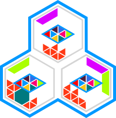

<h1>
<a href="https://mows.cloud">

MOWS - My Own Web Services 
</a>
</h1>

MOWS makes it easy to start your own multi-computer cloud system from scratch. It is not just another home server OS, as it provides powerful APIs, reliability and strong isolation through the use of the extensible and ever growing Kubernetes ecosystem. It can run on your own or rented hardware. It offers an open solution, but still has you covered on all operational basics so you can focus on what truly matters.

MOWS consists of five parts: Operator, Manager, Hardware, Cloud APIs and Apps.
The parts are designed to work together seamlessly, providing a complete
solution for managing your own web services without compromising on the
flexibility to run whatever you want.

The project is in the early stages of development and needs your help to make it reality. 🏗️

To learn more, visit the [Website](https://mows.cloud)
